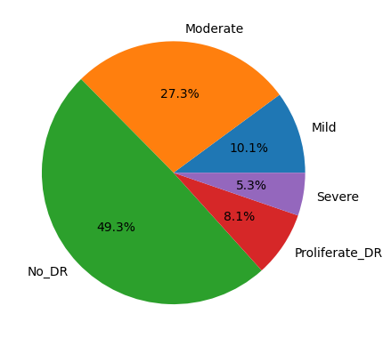

[![Contributors][contributors-shield]][contributors-url]
[![Forks][forks-shield]][forks-url]
[![Stargazers][stars-shield]][stars-url]
[![Issues][issues-shield]][issues-url]
[![MIT License][license-shield]][license-url]
[![LinkedIn][linkedin-shield]][linkedin-url]

<!-- PROJECT LOGO -->
 

  <h3 align="center">Diabetic Retinopathy Detection with AI</h3>

  

     
    <a href="https://github.com/humamchoudhary/Retniopathy-AI"><strong>Explore the docs »</strong></a>
     
     
    <a href="https://github.com/humamchoudhary/Retniopathy-AI">View Demo</a>
    ·
    <a href="https://github.com/humamchoudhary/Retniopathy-AI/issues">Report Bug</a>
    ·
    <a href="https://github.com/humamchoudhary/Retniopathy-AI/issues">Request Feature</a>
  

# Retniopathy-AI

Diabetic Retinopathy is a disease that can result from complications of type 1 and 2 diabetes, caused by prolonged uncontrolled blood sugar levels. It leads to damage to blood vessels in the retina, located at the back of the eyes. In this project, I trained a deep neural network model using Convolutional Neural Networks (CNNs) and Residual Blocks to detect the type of Diabetic Retinopathy from images accurately. With over 347 million people worldwide estimated to be affected by Diabetic Retinopathy, it's a critical health issue. By leveraging the power of deep learning, I aimed to contribute towards early detection and prevention of this leading cause of blindness in the working-age population of the developed world.

# Statics:

### Accuracy: ~77%

### Params: 4 mill (model can easily be scaled upto 80mill)

### dataset: 3.6k images

 

# Data distribution

 
 

from this diagram we can see that data is not evenly distributed hence this model has alot of space to improve.
 

# Example output:

# Limitations:

As this project is a for health and sciences hence even a small mistake can be liable which is why this project is currently cannot be used unsupervised as the accuray of 77% is very low for medical issues. However from the data distribution we can see that this accuray can easly be increased by using a larger dataset with equal classes.

<!-- CONTACT -->

## Contact

Muhammad Humam Choudhary - [linkedIN](https://linkedin.com/in/mhumamch/) - humamchoudhary@gmail.com

Project Link: [Link](https://github.com/humamchoudhary/Retniopathy-AI/)

(<a href="#top">back to top</a>)

## License

[MIT](https://choosealicense.com/licenses/mit/)

<!-- MARKDOWN LINKS & IMAGES -->
<!-- https://www.markdownguide.org/basic-syntax/#reference-style-links -->

[contributors-shield]: https://img.shields.io/github/contributors/humamchoudhary/Retniopathy-AI.svg?style=for-the-badge
[contributors-url]: https://github.com/humamchoudhary/Retniopathy-AI//graphs/contributors
[forks-shield]: https://img.shields.io/github/forks/humamchoudhary/Retniopathy-AI.svg?style=for-the-badge
[forks-url]: https://github.com//humamchoudhary/Retniopathy-AI/network/members
[stars-shield]: https://img.shields.io/github/stars/humamchoudhary/Retniopathy-AI.svg?style=for-the-badge
[stars-url]: https://github.com/humamchoudhary/Retniopathy-AI/stargazers
[issues-shield]: https://img.shields.io/github/issues/humamchoudhary/Retniopathy-AI.svg?style=for-the-badge
[issues-url]: https://github.com/humamchoudhary/Retniopathy-AI/issues
[license-shield]: https://img.shields.io/github/license/humamchoudhary/Retniopathy-AI.svg?style=for-the-badge
[license-url]: https://github.com/humamchoudhary/Retniopathy-AI/blob/master/LICENSE.txt
[linkedin-shield]: https://img.shields.io/badge/-LinkedIn-black.svg?style=for-the-badge&logo=linkedin&colorB=555
[linkedin-url]: https://linkedin.com/in/mhumamch/
"# Retniopathy-AI" 
"# Retniopathy-AI" 
